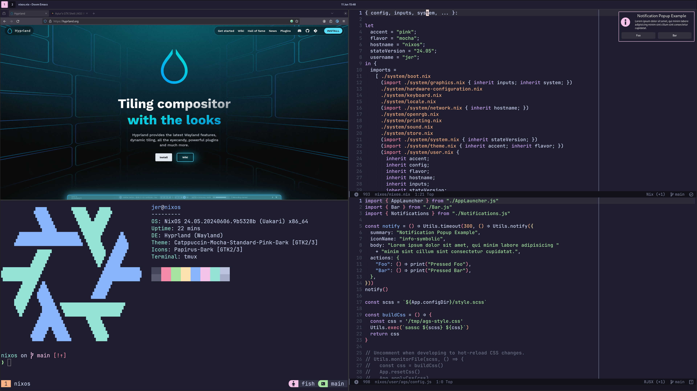

- Install NixOS 24.05.
- Install this NixOS configuration:
  - `sudo rm -rf /etc/nixos`
  - Clone this repo into some directory `d` and then `cd d`.
  - `sudo nixos-generate-config --show-hardware-config > system/hardware-configuration.nix`
  - `git commit -am "install" && sudo nixos-rebuild switch --flake .#nixos`
- Install Doom Emacs:
  - `git clone --depth 1 https://github.com/doomemacs/doomemacs ~/.config/emacs`
  - `~/.config/emacs/bin/doom install`
